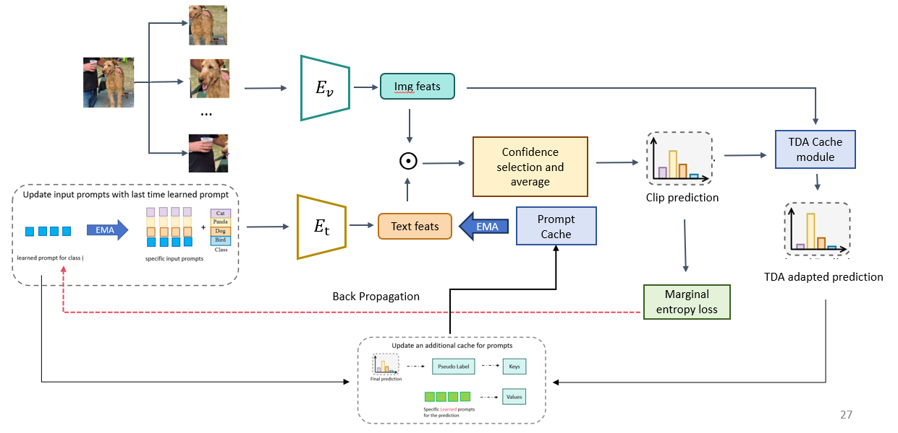

# TDA-Expansion
课题组任务考核（任务二）
## 题干
背景:VLM(例如clip)具有较好的zero-shot泛化能力，然而在面对不同下游任务时(数据漂移)仍然存在性能下降的问题。需要提升clip-based model在目标域上的泛化能力，主要任务有图像分类、图像caption生成以及其余一些clip支持的任务。
第二问：(加分项)在编写的benchmark的基础上，针对之前所调研的文献进行深度探索。选择其中一个或几个尚未解决的limitations/难题归纳总结，进行猜想-实验验证。具体流程为:提出猜想→通过实验给出现象验证问题的存在性→实验分析解决问题的思路→给出解决方案→实验证明方案的可行性(注:解决方案可以只是一个大致的思路，或一个大致的方向，例如认为通过聚类可以解决当前的问题，不用给出聚类的方法，只需假设目前已经聚类完成，拿手动构造后的数据模拟聚类效果并用实验证明该数据可以解决xx问题即可)。提醒:无论探索是否有结果，中间过程均可以记录，作为汇报和分析的一环。
## Overviews

## Running
### TDA + TPT
```bash
# for ood
bash ./scripts/run_ood_benchmark_vit_2.sh
# for cd
bash ./scripts/run_cd_benchmark_vit_2.sh

```
### Ours
```bash
# for ood
bash ./scripts/run_ood_benchmark_vit_4.sh
# for cd
bash ./scripts/run_cd_benchmark_vit_4.sh

```
